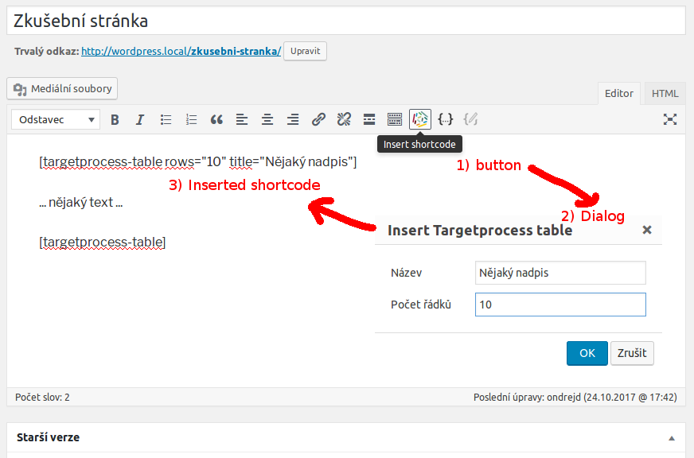

# odwp-targetprocess

[WordPress][1] plugin that uses [Targetprocess][2] API to publish user stories on your site.

## Main features

* shortcode `targetprocess-table` which displayes your data from [Targetprocess][2]
* new settings on `WP Amin > Settings > General`

## Screenshots

### Settings ([WordPress][1] administration > Settings > General)

### Admin notices

Plugin provides several _WP_ admin notices that inform you about status of the plugin:

When you activate the plugin and settings are not set yet:

When your settings are correct:

When your settings are not correct:

When your `wp-config.php` settings block external requests:

### Shortcode for TinyMCE

When you editing posts or pages you can easily add our shortcode with table with user stories:

## TODO

* [x] ~~create settings with `odwptp_login` and `odwptp_password` (using [Settings API][4])~~
* [x] ~~if `odwptp_login` and `odwptp_password` are set try to get [token][3]~~
  - [x] ~~__FIXME__ check if `WP_HTTP_BLOCK_EXTERNAL` is _false_ and take an action if not~~
  - [x] ~~__FIXME__ Success message should react on "Don't show again" link~~
* [x] ~~create shortcode `targetprocess-table` which will present the data on the front-end~~
  - [x] ~~add TinyMCE button with our shortcode (including configuration dialog)~~
  - [ ] add basic table features: ~~pagination, sorting,~~ __TODO filtering !!!__
  - [x] ~~_UserStory->Description_ should be visible in the table after click~~
  - [ ] __add AJAX support (pagination, sorting, filtering should be done without whole page's reload)__
* [x] ~~add setting `odwptp_url` which holds URL of Targetprocess API serverhost~~
* [ ] __enable localization (Czech and English)__
  - [ ] __FIXME script for shortcode's TinyMCE button should be localized__

## Changelog

__Note:__ Versions are in reverse order. If any version is marked as _in development_ that it means that bolded todos are mean for this version.

### Version 0.6 _(future)_

* refactor `ODWP_TP_Table::parse_user_stories` in way that user can fully customize their `targetprocess-table` shortcode

### Version 0.5 _(in development)_

* progress on `targetprocess-table` shortcode - added filtering and AJAX
* fixed some small issues
* prepared for the release

### Version 0.4

* progress on `targetprocess-table` shortcode - added pagination and sorting
* fixed some issues
* prepared for the first release

### Version 0.3

* added initial version of `targetprocess-table` shortcode
* added TinyMCE button for our shortcode

### Version 0.2

* finished plugin settings

### Version 0.1

* initial version
* created [GitHub repository][5]

[1]: https://wordpress.org/
[2]: https://www.targetprocess.com/
[3]: https://dev.targetprocess.com/docs/authentication
[4]: https://developer.wordpress.org/plugins/settings/settings-api/
[5]: https://github.com/ondrejd/odwp-targetprocess
