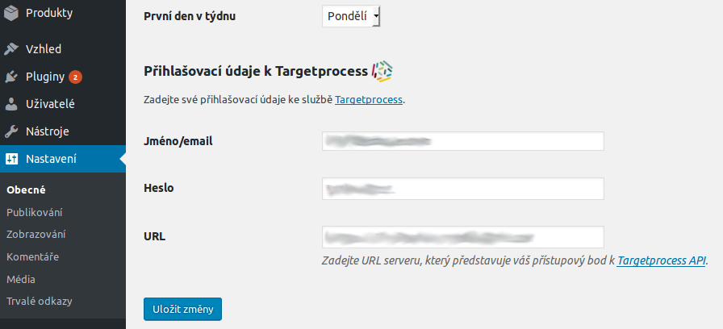

# odwp-targetprocess

[WordPress][1] plugin that uses [Targetprocess][2] API to publish user stories on your site.

## Main features

* ...

## Screenshots

### Settings ([WordPress][1] administration > Settings > General)

### Admin notices

Plugin provides several _WP_ admin notices that inform you about status of the plugin:

When you activate the plugin and settings are not set yet:

When your settings are correct:

When your settings are not correct:

When your `wp-config.php` settings block external requests:

## TODO

* [x] ~~create settings with `odwptp_login` and `odwptp_password` (using [Settings API][4])~~
* [x] ~~if `odwptp_login` and `odwptp_password` are set try to get [token][3]~~
  - [x] ~~__FIXME__ check if `WP_HTTP_BLOCK_EXTERNAL` is _false_ and take an action if not~~
  - [x] ~~__FIXME__ Success message should react on "Don't show again" link~~
* [ ] __create shortcode which will present the data on the front-end__
* [x] ~~add setting `odwptp_url` which holds URL of Targetprocess API serverhost~~
* [ ] enable localization (Czech and English)

## Changelog

__Note:__ Versions are in reverse order.

### Version 0.2

* finished plugin settings

### Version 0.1

* initial version
* created [GitHub repository][5]

[1]: https://wordpress.org/
[2]: https://www.targetprocess.com/
[3]: https://dev.targetprocess.com/docs/authentication
[4]: https://developer.wordpress.org/plugins/settings/settings-api/
[5]: https://github.com/ondrejd/odwp-targetprocess
